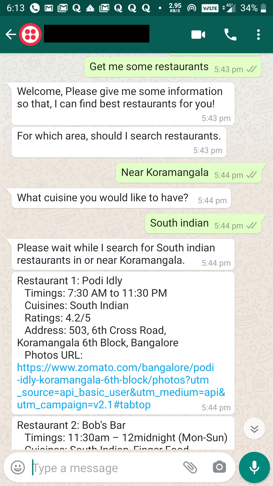
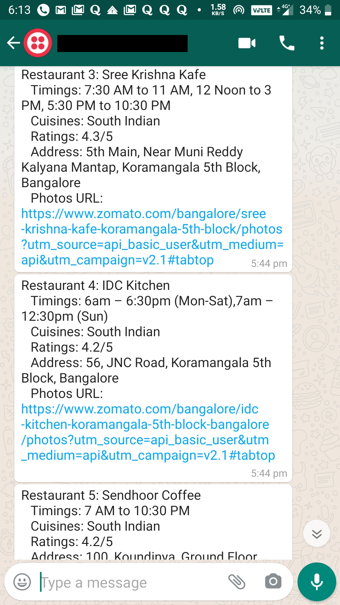
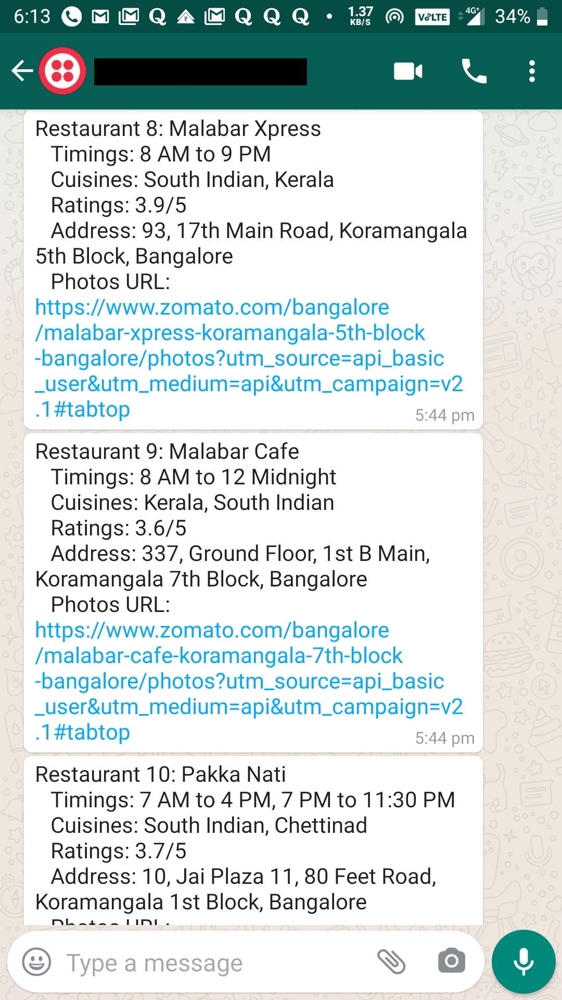
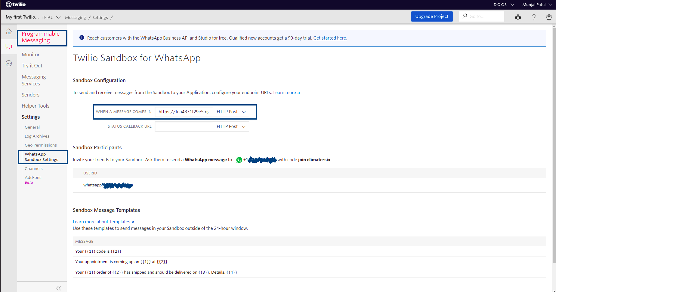

<h2> About the project </h2>

A restaurant finder chatbot that is based on Rasa 2.2 backend and consumes Zomato API to find the restaurant for a user given location.
Chatbot requires 2 inputs from user: location and cuisine to find the restaurants using Zomato API. Chatbot is connected to Whatsapp via Twilio, 
hence a user can find restaurants via Whatsapp. 

<h2> Screens </h2>

<table>
  <tr>
    <td></td>
    <td></td>
    <td></td>
  </tr>
 </table>

<h2> Technolgy stack used </h2>

1. [Rasa 2.2](https://rasa.com/) - Chatbot backend framework
2. [Twilio API](https://www.twilio.com/) - To connect to Whatsapp using REST based API 
3. [Ngrok](https://ngrok.com/) - To generate public ip address and connect to the local rasa server
4. [Zomato API](https://developers.zomato.com/api) - API to query the Zomato's restaurant database

<h2> Prerequisites </h2>

1. Install [rasa 2.2](https://rasa.com/docs/rasa/installation/)

2. Generate [Zomato API key](https://developers.zomato.com/api)

3. Create account in Twilio and start the [whatsapp sandbox](https://www.twilio.com/console/sms/whatsapp/learn).

4. Install [ngrok](https://ngrok.com/download) in the local machine and add your authorization token. 

<h2> Model Training </h2>

The repo contains ssd efficientdet model trained with 20,000 iterations using Google Colab. You can also refer to [my colab notebook](https://colab.research.google.com/drive/1tGTuIg2xJipoln8IC8cxH35Wr4nJ7930?usp=sharing), where I have tried to explain step by step flow for performing model training using Tensorflow2 object detection API. 

<h2> Installation & Usage</h2>

1. Clone the repo using following command 
    
        $ git clone https://github.com/coolmunzi/face_mask_detector.git
2. Create a virtual environment and change the directory to the cloned repo
3. Change your directory to the cloned repo and create a Python virtual environment named 'test'
   
4. Add twilio credentials in credentials.yml file:
         
         twilio: 
           account_sid: "{Add your account sid}"
           auth_token: "{Add your Authorization token}"
           twilio_number: "whatsapp:+{Add your twilio number}" 

5. Add your zomato api key in zomatoApi.py file inside script folder.
         
         headers = {'user-key': '{Put your Zomato API key here}',
           'Accept': 'application/json'}

6. Train the rasa model:
         
         $ rasa train

7. Start the  rasa server from terminal:

         $ rasa run -m models --enable-api --cors "*" --debug

8. Start rasa actions server in another terminal:
         
         $ rasa run actions

9. Start ngrok from terminal
         
         $ ./ngrok http 5005

10. Copy the forwarding ip address generated by ngrok and paste the same in _'WHEN A MESSAGE COMES IN'_ field inside Whatsapp Sandbox settings in Programmable Messaging Settings as highlighted in the below image.

   The end point should be in the format as shown below:
         
         {Ngrok generated ip address}/webhooks/twilio/webhook

